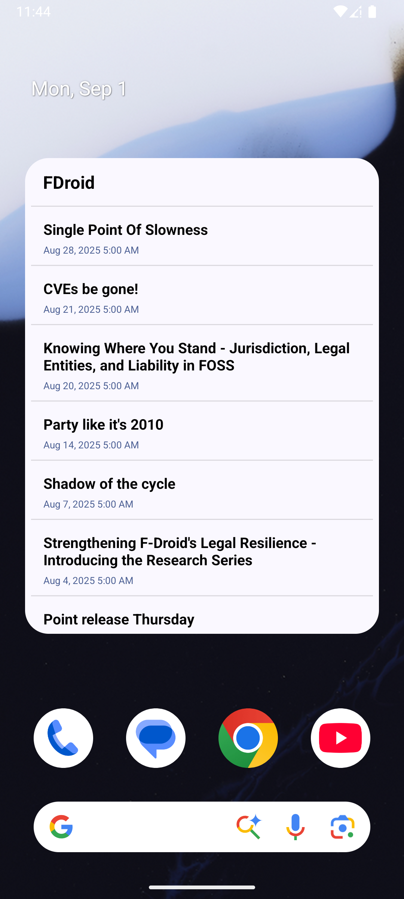

<p align="center">

</p>

<h1 align="center"><b>📖 KindleCast</b></h1>
<h4 align="center">Convert ebooks and send to your Kindle</h3>
<p align="center">

<div align="center" style="display: flex; justify-content: center; align-items: flex-start; gap: 12px; flex-wrap: wrap;">
  <a href="https://f-droid.org/packages/io.github.byter11.kindlecast">
    
  </a>
  <a href="https://github.com/byter11/kindlecast/releases">
    
  </a>
</div>


<b>KindleCast</b> converts ebooks (.epub) and serves them on the network, making it easy to transfer books to a Kindle device.

## Features
- Convert and host ebooks in a single tap.
- Supports sharing epubs directly to the app.
- Save or share the converted .azw3 ebook, or download using the Kindle web browser.
- Material You theming


## Screenshots

|                        |                        |                        |
|------------------------|------------------------|------------------------|
|  |  | 

## Getting Started

### Prerequisites

- Android Studio Hedgehog or newer
- Android device or emulator (API 33+)

### Building

Clone the repository and open in Android Studio:

```sh
git clone https://github.com/yourusername/kindlecast.git
cd kindlecast
```

Build and run using Android Studio or:

```sh
./gradlew assembleDebug
```

## Notes
- Only .epub files are supported for now.

Uses Calibre under the hood: https://calibre-ebook.com/

## Dependencies

- AndroidX Core, AppCompat
- Material Components
- [Chaquopy](https://chaquo.com/)

## License

This project is licensed under the [Apache License 2.0](LICENSE).

## Acknowledgements
[Calibre](https://calibre-ebook.com)