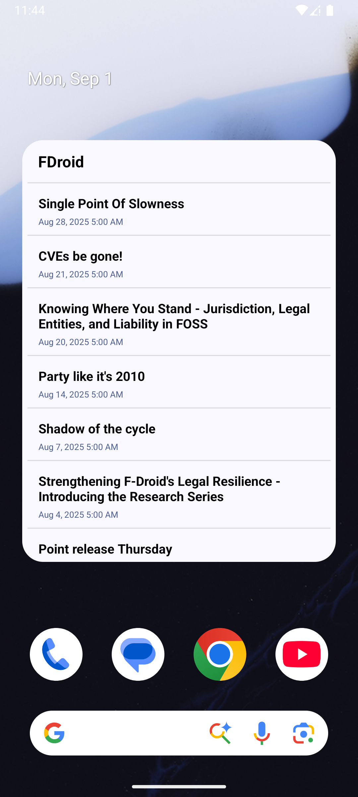
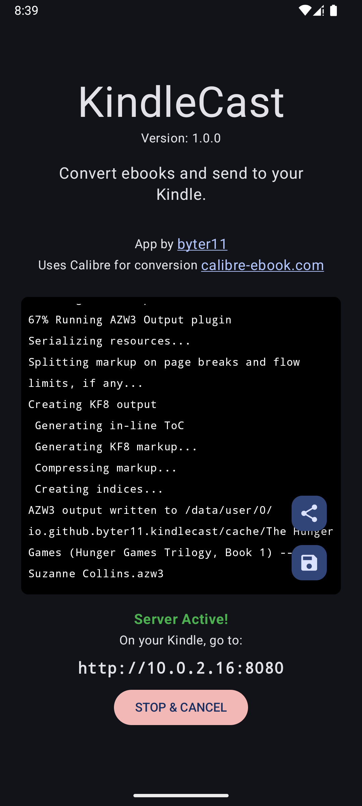
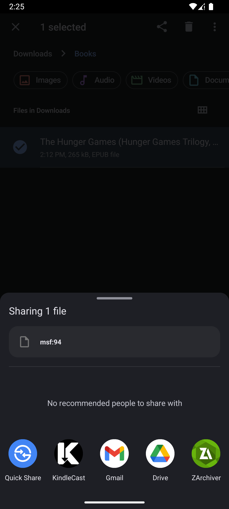

<p align="center">

</p>

<h1 align="center"><b>📖 KindleCast</b></h1>
<h4 align="center">Convert ebooks and send to your Kindle</h3>
<p align="center">

<div align="center" style="display: flex; justify-content: center; align-items: flex-start; gap: 12px; flex-wrap: wrap;">
  <a href="https://play.google.com/store/apps/details?id=io.github.byter11.kindlecast">
    
  </a>
</div>


**KindleCast** converts EPUB, MOBI, and DOCX files into Kindle-friendly formats and hosts them on your local network. Simply open the generated link on your Kindle's web browser, and your book is ready to read.

## Features
- One-Tap Conversion: Effortlessly convert ebooks and start hosting them instantly.
- Works Completely Offline: Your books stay on your device.
- Wireless Transfer: Download converted books directly using the Kindle web browser.
- Broad Format Support: Works with EPUB, MOBI, and DOCX files.
- Seamless Integration: Share ebooks directly from other apps to KindleCast for quick processing.
- Modern Design: Beautiful Material You interface with dynamic theming.


## Screenshots

|                        |                        |                        |
|------------------------|------------------------|------------------------|
|  |  | 

## Getting Started

### Prerequisites

- Android Studio Hedgehog or newer
- Android device or emulator (API 33+)

### Building

Clone the repository and open in Android Studio:

```sh
git clone https://github.com/yourusername/kindlecast.git
cd kindlecast
```

Build and run using Android Studio or:

```sh
./gradlew assembleDebug
```

Uses Calibre under the hood: https://calibre-ebook.com/

## Dependencies

- AndroidX Core, AppCompat
- Material Components
- [Chaquopy](https://chaquo.com/)

## License

This project is licensed under the [GNU General Public License v3.0](LICENSE).

## Acknowledgements
[Calibre](https://calibre-ebook.com)
[Chaquopy](https://chaquo.com/chaquopy/)

## Trademark Disclaimer
"Kindle" is a registered trademark of Amazon.com, Inc. KindleCast is not affiliated with, endorsed by, or sponsored by Amazon. This app is an independent tool created for personal use and to facilitate device interoperability.
